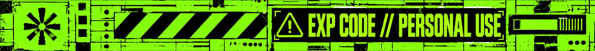

<div align="center">
  
</div>

# omarchy-mgldvd

Personal improvements for my [Omarchy](https://omarchy.org/) install, mostly
aimed at making the mouse (and a few keyboard/terminal details) nicer to use.
This is **not** a public plugin and does not follow Omarchy's official plugin
system (that one is for QML bar/shell widgets via Quickshell, see
https://plugins.omarchy.org/develop.html). It is my own repo with an
installer/uninstaller and a menu, meant only for my setup, which edits
Hyprland's `.lua` files directly.

## Usage

```bash
./run       # terminal menu (gum)
./run-gui   # graphical window (QML/Quickshell)
```

`./run` opens a terminal menu that shows each improvement and whether it is
installed (`●`) or not (`○`), and lets you Install, Uninstall or Configure it.

`./run-gui` opens a window (with `qs -n -p gui/Main.qml`, a Quickshell instance
independent from the main `omarchy-shell`) with the same thing but friendlier
to use with the mouse: one card per improvement with its status (●/○
installed) and "Install"/"Uninstall" and "Configure" buttons.

- **Detached from the terminal:** `./run-gui` starts the window in its own
  session (`setsid`, no tty, output discarded) and returns immediately, so the
  prompt comes back and closing the terminal or pressing Ctrl+C doesn't kill
  the window.
- **Closing:** the "✕ Close" button (top right), `Escape` or `Ctrl+Q`.
- **Maximized:** on Hyprland, `gui/maximize.sh` waits for the window to appear
  and maximizes it exactly like Omarchy's `SUPER + ALT + F` ("Full width"),
  instead of opening as a half-width tile. It has to be done from outside
  because Omarchy ignores maximize requests made by apps
  (`suppress_event = "maximize"`).
- **Style:** Omarchy-like and flat: JetBrainsMono Nerd Font, square corners and
  wireframe (outline-only) buttons. The colors are read from the current
  Omarchy theme (`~/.local/state/omarchy/current/theme/colors.toml`) and
  refreshed every few seconds, so the window follows theme changes (Tokyo Night
  is the fallback).
- **Configure** opens a terminal (`foot`) running the same interactive
  `improvement.sh configure` that `./run` uses, since each improvement's options
  are different and a graphical form per improvement isn't worth it. The
  exception is improvements that expose numeric options as sliders (see
  "Sliders in the graphical window" below).

`gui/list.sh` is the script that feeds the window the list of improvements as
JSON (name, description, status, sliders).

## How it works

- Each improvement lives in `improvements/<name>/improvement.sh`, a script with
  subcommands: `name`, `description`, `status`, `install`, `uninstall`,
  `configure` (and, optionally, `sliders` and `set`).
- Installing an improvement generates a Lua file at
  `~/.config/hypr/mgldvd/<name>.lua` and adds a marked `require(...)`
  (`-- >>> omarchy-mgldvd:<name> >>>`) to `~/.config/hypr/bindings.lua`, which
  is where Omarchy loads the user's keyboard/mouse overrides.
- Uninstalling deletes that marked block and the generated Lua file.
- The first time a file (`bindings.lua`, `input.lua`, `looknfeel.lua`,
  `foot.ini`) is touched, a copy `<file>.mgldvd-backup` is saved.
- Each improvement's tunable options (button codes, timings, etc.) are stored
  in `~/.config/omarchy-mgldvd/<name>.conf`.
- The status printed by `improvement.sh status` is `installed` or
  `not-installed`.

### Safety rule: never `hyprctl`/`io.popen` inside a Lua bind

A Hyprland bind can be a Lua function (`function() ... end`), but that function
runs on the compositor's main thread. If it calls `io.popen("hyprctl ...")`
(or any other command that talks to Hyprland's own socket) and waits for the
result, the main thread ends up blocked waiting for a reply that the same
blocked thread would have to produce: mouse and keyboard freeze. This already
happened once in this repo and was fixed like this:

- If an action needs to query state (e.g. the workspace list, the active
  window) before deciding what to do, that logic goes in an **external bash
  script**, generated by the improvement, and the bind just references it as a
  string dispatcher (`o.bind(key, desc, "/path/to/script.sh args")`). A string
  dispatcher is launched asynchronously (like any `exec`), so the script can
  call `hyprctl` freely without blocking anything.
- Before installing a new bind that runs something, test the script standalone
  with `timeout 5 ./script.sh args` and confirm with `hyprctl activeworkspace`
  (or similar) that Hyprland is still responding.

## Available improvements

### persistent-workspaces

Marks workspaces 1 to N (10 by default, adjustable) as `persistent` via
`hl.workspace_rule({ workspace = tostring(i), persistent = true })`. By default
Hyprland destroys an empty workspace as soon as you leave it (unless it is
persistent); that made a workspace that was created but had no apps (e.g. 5)
vanish from `hyprctl -j workspaces` the moment you left, and
`mouse-forward-back`/`mouse-workspace-switch` could no longer jump back there.
With this improvement those empty workspaces are always available to navigate.

Added as a marked block in `~/.config/hypr/looknfeel.lua`.

### scrolling-layout

Switches Hyprland's tiling layout from `dwindle` (tree) to the native
`scrolling` layout (niri/PaperWM style): windows are laid out on a horizontal
strip that extends to one side (to the right by default) and can go past the
viewport; as you open more applications they keep being added to that side, and
Hyprland scrolls to show them. By default it **does not wrap** at the edges:
reaching the last column, `focus r` doesn't go back to the first (and `focus l`
on the first doesn't go to the last); this is `scrolling:wrap_focus = false`.
Adjustable from the menu: direction (`right`/`left`/`down`/`up`), column width
(`column_width`, 0.1 to 1.0) and whether it wraps at the edges.

Added as a marked block in `~/.config/hypr/looknfeel.lua`. The other mouse
improvements that move between "columns" assume this one is installed.

### mouse-workspace-switch

The mouse side buttons (back/forward) + `CTRL` switch workspace directly,
without depending on a double click or on which tile you are in:

- `CTRL + back button` (evdev `mouse:275`, `BTN_SIDE`) -> next workspace
- `CTRL + forward button` (evdev `mouse:276`, `BTN_EXTRA`) -> previous workspace

**It does not wrap at the edges**: on the last workspace, "next" doesn't wrap
to the first (nor the reverse). Hyprland has no flag for this in its native
`e+1`/`e-1` selector (the wiki explicitly says that selector "wraps around"),
so an external script (`mouse-workspace-switch-nowrap.sh`) walks the workspace
list (`hyprctl -j workspaces`) by hand and does nothing if you are already at
the edge.

The button codes can be changed from the menu (`Configure`) if your mouse uses
other codes (check them with `wev`). It coexists with `mouse-forward-back`
without conflict because it uses a different modmask (`CTRL` vs. no modifier).

### mouse-forward-back

The same side buttons, **with no modifier and no extra button**, do everything:

- Normally, `back`/`forward` move focus to the next/previous column of the
  `scrolling` layout (`hl.dsp.layout("focus r"/"focus l")`).
- At the first/last tile, a click stays put (nothing happens).
- A **second click in that same direction within a short time window** (450 ms
  by default, adjustable) counts as a double click at the edge: that does
  switch workspace in that direction (with the same no-wrap logic as
  `mouse-workspace-switch`).

Everything runs in a generated external script (`mouse-forward-back-move.sh`,
see the safety rule above): it compares the active window before/after trying
to move column to know whether it actually moved or was at the edge, and keeps
a small state file (`~/.config/omarchy-mgldvd/mouse-forward-back-edge`,
timestamp + direction) to recognize the double click. The button codes and the
double-click window (`DOUBLECLICK_MS`) are adjusted from the menu.

**Requires `scrolling-layout` to be installed.**

**Side effect:** it also sets `input:follow_mouse = 2` in
`~/.config/hypr/input.lua` (marked block, reverted on uninstall). By default
(`follow_mouse = 1`) keyboard focus follows the cursor just by hovering; since
switching column with the side button doesn't move the cursor, without this
setting focus would immediately "bounce" back to the window under the cursor
(you had to click again for it to work). With `follow_mouse = 2` keyboard focus
is decoupled from plain hover: it only changes on click.

### sunshine-mouse-buttons

When this machine is the Sunshine server, the side buttons of the Moonlight
**client's** mouse may not arrive as buttons (`mouse:275` / `mouse:276`) but as
**keys**: for example, Solaar on the client turns them into `Ctrl+Alt+Left` /
`Ctrl+Alt+Right`, and Moonlight forwards those keys. This improvement binds
those keys to the same scripts as `mouse-forward-back`:

- `LEFT_KEY` (default `CTRL + ALT + Left`) -> previous column; double click at
  the edge -> previous workspace.
- `RIGHT_KEY` (default `CTRL + ALT + Right`) -> next column; double click at
  the edge -> next workspace.

It is independent from the desktop mouse configuration: it has its own Lua file
(`~/.config/hypr/mgldvd/sunshine-mouse-buttons.lua`), its own marked block in
`bindings.lua` and its own `.conf`. Installing or uninstalling it doesn't touch
the `mouse-forward-back` / `mouse-workspace-switch` binds, and it uses
different keys, so they don't clash. The keys are adjusted from the menu
(`Configure`); they must match what the client sends (check with `wev` or
`cat -v` on the server while the client presses the button).

**Requires `mouse-forward-back` to be installed**, because it reuses its
`mouse-forward-back-move.sh` script. If you uninstall `mouse-forward-back`,
these binds stop doing anything. Note: `Ctrl+Alt+Left/Right` also fire from the
server's physical keyboard.

### key-repeat

Tunes Hyprland's key repeat delay and rate (`input:repeat_delay` /
`input:repeat_rate`). Omarchy ships a 250 ms delay and 40 repeats per second;
with such a short delay, holding a key for a moment (or having the key release
arrive late when using Sunshine/Moonlight) is enough to make it repeat, for
example a paste that fires 2 or 3 times. By default the improvement uses 500 ms
and 25/s.

- Ranges: delay 150-1000 ms, rate 5-60 per second.
- Applied with a marked block in `~/.config/hypr/input.lua`; on uninstall
  Omarchy's values come back.
- In `./run-gui` **two sliders** (one per value) appear under the card; on
  release the slider is applied immediately. In `./run` it is adjusted with
  `Configure` (typing the numbers).

### terminal-ctrl-v

Adds `Control+v` to `clipboard-paste` in `~/.config/foot/foot.ini`, so Ctrl+V
pastes in the terminal (in addition to Shift+Insert and Ctrl+Shift+V). **Ctrl+C
is not touched**: it keeps interrupting processes, because foot can't "copy
only if there is a selection" and binding Ctrl+C to copy would stop it from
interrupting. To copy you still use Ctrl+Shift+C or Super+C.

Side effects: foot consumes Ctrl+V, so terminal apps that use it for
themselves (vim in block mode, pasting images in some CLIs) stop receiving it;
and foot doesn't reload its configuration live, so it only applies to new
windows. Uninstalling removes only that `Control+v` from the line.

## Sliders in the graphical window

An improvement can expose numeric options so `./run-gui` shows them as
sliders. To do so it implements two optional subcommands in its
`improvement.sh`:

- `sliders`: prints a JSON array
  `[{"key","label","min","max","step","value"}, ...]`.
- `set KEY VALUE`: validates and saves a value and, if the improvement is
  installed, applies it.

`gui/list.sh` includes that list as `sliders` in each improvement (empty if it
doesn't implement it) and `gui/Main.qml` draws one slider for each.
