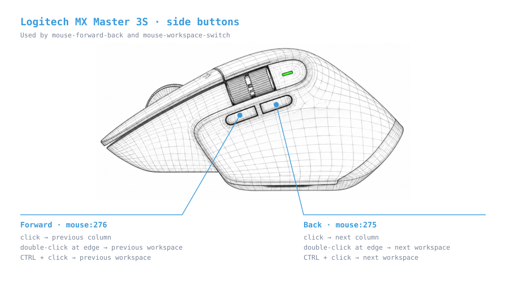

<div align="center">
  
</div>

> Warning: This repo is experimental and intended for personal use.

# omarchy-mgldvd

Personal tweaks for my [Omarchy](https://omarchy.org/) install, mostly to make
the mouse nicer to use. Not an official Omarchy plugin.

## Usage

```bash
./run       # terminal menu
./run-gui   # graphical window
```

Both let you **Install**, **Uninstall** or **Configure** each improvement
(`●` installed, `○` not installed).

## Improvements

Each one is optional: turn it on or off whenever you want from the menu.

- **persistent-workspaces** — Keeps workspaces 1–10 alive even when empty.
- **scrolling-layout** — Switches to Hyprland's horizontal `scrolling` layout
  (niri/PaperWM style), without wrapping at the edges.
- **mouse-workspace-switch** — `CTRL` + mouse side buttons switch workspace.
- **mouse-forward-back** — Mouse side buttons move between columns; double
  click at the edge switches workspace. *Requires `scrolling-layout`.*
- **sunshine-mouse-buttons** — Same as above, for a Moonlight client that
  sends the side buttons as `Ctrl+Alt+Left/Right`.
  *Requires `mouse-forward-back`.*
- **key-repeat** — Slower key repeat (500 ms / 25 per second) to avoid
  accidental repeats.
- **terminal-ctrl-v** — `Ctrl+V` pastes in the `foot` terminal.

<div align="center">
  
</div>

## How it works

- Each improvement is a script in `improvements/<name>/improvement.sh`.
- Installing adds a marked block to Hyprland's config
  (`~/.config/hypr/`); uninstalling removes it.
- A `.mgldvd-backup` copy is saved the first time a file is edited.
- Settings are stored in `~/.config/omarchy-mgldvd/<name>.conf`.

> **Note:** never call `hyprctl` from inside a Lua bind, it freezes Hyprland.
> Use an external script instead.
